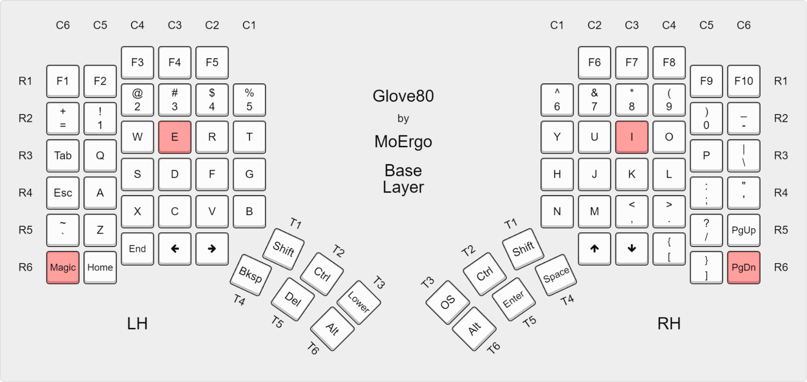

# glove80-zmk-config

Keymap/config-only repo for a Moergo Glove80, built against [kalinnorman/zmk_glove80](https://github.com/kalinnorman/zmk_glove80) (a customized fork adding a Seeed XIAO BLE dongle and RGB battery indicators) instead of Moergo's own [`moergo-sc/zmk`](https://github.com/moergo-sc/zmk).

Modeled on Moergo's official [`glove80-zmk-config`](https://github.com/moergo-sc/glove80-zmk-config) template (Nix-only, no `west`/Zephyr toolchain required) rather than the [`glove80-zmk-config-west`](https://github.com/moergo-sc/glove80-zmk-config-west) template, since Moergo's own docs point people at the non-`west` one as the current/recommended path.

The point of this repo: edit `config/glove80.keymap` here, without needing to touch or rebuild the full `zmk_glove80` firmware fork. The firmware fork still owns everything that isn't the keymap - the dongle shield, the RGB underglow/battery code, board definitions, etc.

## Layout

- `config/glove80.keymap` - the keymap. Edit this for keymap changes.
- `config/glove80.conf` - extra Kconfig for the LH/RH halves (currently empty).
- `config/glove80_lh_dongle_peripheral.conf` - extra Kconfig for the LH half specifically when running in dongle-peripheral mode (mirrors the same file in the firmware fork).
- `config/default.nix` - Nix build definitions. Exposes: `glove80_left`, `glove80_right`, `glove80_combined` (both halves in one `.uf2`), and the dongle-mode counterparts `glove80_dongle_left`/`glove80_dongle_right`/`glove80_dongle_xiao`, plus `glove80_settings_reset_{xiao,left,right}`.

## Building via GitHub Actions (primary path)

Push to this repo and the `Build` workflow (`.github/workflows/build.yml`) builds every target above against the `xiao-ble-dongle-rgb` branch of `zmk_glove80`, and bundles the resulting `.uf2` files into one `glove80-firmware` artifact you can download from the Actions run.

If the customizations get merged into `zmk_glove80`'s `main` branch, update the `ref:` in that workflow file accordingly.

## Building locally with Nix

Requires [Nix](https://nixos.org/) installed (see the devcontainer's `Dockerfile`, which installs it) and, for reasonable build times, the `moergo-glove80-zmk-dev` Cachix binary cache configured (`cachix use moergo-glove80-zmk-dev`) so you're not compiling the whole Zephyr/GCC toolchain from source.

`config/default.nix` expects a checkout of the firmware fork at `../src` relative to itself (i.e. a `src/` directory next to `config/`, at this repo's root) - that's what CI sets up via `actions/checkout`. Locally, instead of a second clone, symlink it to an existing checkout, e.g. from this repo's root:

```sh
ln -s ../repo_zmk_glove80 src   # if this repo lives next to repo_zmk_glove80, as in this workspace
```

Then build a target:

```sh
nix-build config -A glove80_left -o result
# firmware is at result/zmk.uf2
```

Build the combined LH+RH image (what you'd actually flash for a non-dongle setup):

```sh
nix-build config -A glove80_combined -o result
```

## Flashing

### Entering bootloader mode

Each half (and the XIAO dongle) needs to be put into UF2 bootloader mode individually before you can copy firmware onto it. The keymap here has no `&bootloader` binding anywhere, so the **power-on key combo** below is the way to do it for the Glove80 halves - it's handled by the bootloader itself, below ZMK, so it works no matter what firmware (or lack of working firmware) is currently on the half:


(Image credit: [MoErgo](https://docs.moergo.com/glove80-user-guide/customizing-key-layout/))

For the Glove80 halves:

1. Power off the half.
2. Plug the half into the computer via USB.
3. Hold down two keys highlighted in the image above (matrix position `C6R6` + `C3R3`):
   - the bottom-outer-most key (pinky), plus the middle finger key one row above the home row.
4. While still holding both keys, swith on the power of the half.
5. A USB mass-storage drive should appear on your computer (`GLV80LHBOOT`/`GLV80RHBOOT`) and you can release the held keys.

See [Moergo's own docs](https://docs.moergo.com/glove80-user-guide/customizing-key-layout/) ("Putting Glove80 into Bootloader for firmware loading") for their coverage.

For the XIAO BLE dongle:

1. Locate the reset button.
2. Ensure that the dongle is plugged into the computer via USB.
3. Double tap the reset button.
4. A USB mass-storage drive should appear on your computer.

### Copying the firmware

Once a target is in bootloader mode, copy the matching `.uf2` file onto the drive that appeared. The drive disappears on its own once the flash completes and the board reboots - no need to safely-eject first. (If Windows shows an "operation interrupted" error mid-copy, that's just a timing quirk - the flash already succeeded by that point.)

Flash the matching `glove80_settings_reset_*` image first if a board was previously paired in a different role (e.g. switching a half between dongle-peripheral and standalone-central mode), otherwise you can just flash the new keymap file to both halves with no settings reset necessary.
